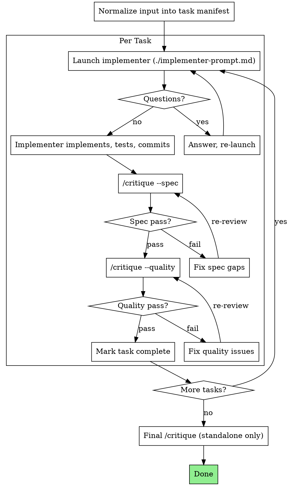

Arguments: $ARGUMENTS

# Plan Runner

Sequential task executor: read a plan, implement each task via a child context, verify with `/critique` review gates, repeat until complete.

## Modes

| Mode | When | Plan-runner does | Harness does |
|---|---|---|---|
| **Standalone** | User or `/caffeine` calls directly | Drives task loop + runs `/critique` gates + owns ledger | N/A |
| **Embedded** | `/harness` delegates during run phase | Parses plan + dispatches implementer per task | Drives round loop, runs verification gates, owns state + final review |

**Standalone**: plan-runner owns the full lifecycle — task sequencing, implementer dispatch, `/critique --spec`, `/critique --quality`, final `/critique` (full), and its own ledger.

**Embedded**: plan-runner becomes a plan adapter + implementer dispatcher. Harness drives one round per task:

```
harness round N (for task N):
  propose:  plan-runner dispatches implementer
  verify:   harness runs verification gates (/critique --spec, /critique --quality)
  evaluate: harness decides keep/discard
  record:   harness writes state.jsonl
```

Plan-runner does not drive the task loop, run reviews, maintain its own ledger, or run final critique in embedded mode.

## Dispatch Model

### Standalone

- Implementer and review gates are all foreground child contexts.
- Controller consumes results sequentially. Do not background these.
- Spec and quality review go through `/critique --spec` and `/critique --quality`.
- Orchestration stays in controller. Child workers do not invoke `/fanout` or `/critique`.

### Embedded (in /harness)

- Plan-runner only dispatches the implementer child context.
- Harness runs `/critique --spec` and `/critique --quality` as verification gates.
- Plan-runner does not invoke `/critique` directly — harness owns the verification step.

## Size Gate

- Multiple independent tasks or cross-file tasks needing staged verification: use this skill.
- Single low-risk task (one-file fix, obvious local change): stay local.
- If coordination overhead exceeds implementation effort: too heavy for this skill.
- Once chosen, keep the full gate: implement -> spec review -> quality review. No "half-gate" shortcuts.

## The Process (Standalone)

The flowchart below shows standalone mode. In embedded mode, harness drives the round loop and runs verification gates; plan-runner only provides the implementer dispatch.



## Input Normalization

Plan-runner accepts tasks from multiple sources:

- Plan file path (reads and extracts tasks)
- Inline task list (from harness or caller)
- Existing task manifest (resume)

All inputs are normalized into a canonical task manifest before execution:

```yaml
tasks:
  - id: 1
    subject: "<task title>"
    full_text: "<complete task description>"
    acceptance: "<what counts as done>"
    dependencies: []
    status: pending
```

The manifest is the authoritative source. TodoWrite (if used) is a projection.

## Handling Implementer Status

**DONE:** Standalone: 进入 `/critique --spec`。Embedded: return to harness for verification gates。

**DONE_WITH_CONCERNS:** 实现完成但有疑虑。先读 concerns：正确性/范围问题先处理再 review；观察性备注记录后继续 review。

**NEEDS_CONTEXT:** 缺少信息。补充上下文后重新 launch。

**BLOCKED:** 无法完成。评估原因：
1. 上下文不足 -> 补充后重新 launch
2. 推理能力不够 -> 用更强模型重新 launch
3. 任务过大 -> 拆分
4. 计划本身有误 -> 上报用户

不要忽略 escalation，不要让同一模型在没有变化的情况下重试。

## Task Ledger

### Standalone Mode

Append-only JSONL ledger at `.agents/plan-runner.jsonl`. Events:

- `task_started`: `{task_id, subject, timestamp}`
- `review_completed`: `{task_id, profile: "spec"|"quality", verdict: "pass"|"fail", timestamp}`
- `task_completed`: `{task_id, timestamp}`
- `run_completed`: `{final_verdict, timestamp}`

启动时：若 ledger 存在且有未完成任务，从 ledger 恢复进度。

### Embedded Mode (in /harness)

Do not write `.agents/plan-runner.jsonl`. Instead:

- Task manifest stored as harness artifact: `.harness/tasks/<task_id>/artifacts/plan-manifest.yaml`
- Harness drives one round per task. Harness owns commit/rollback and verification.
- Plan-runner only provides implementer dispatch per round. No task loop, no review calls, no ledger.

## Red Flags

Never:
- 未经用户同意在 main/master 上开始实现
- 跳过任何一阶段 review（spec 或 quality）
- 带着未修复的问题继续
- 并行 launch 多个 implementer（文件冲突）
- 让 child context 自己读计划文件（应提供完整文本）
- 省略场景上下文
- spec compliance 有问题时接受"差不多"
- 在 spec pass 之前开始 quality review
- Embedded 模式下运行 `/critique` 或驱动 task loop（harness 负责 verification 和 round 循环）
- Embedded 模式下写自己的 ledger（harness 拥有 state）

Implementer 提问时：完整回答，必要时补充上下文。
Reviewer 发现问题时：implementer 修复 -> reviewer 再次 review -> 循环直到通过。
Child context 失败时：launch 新 child context 修复，不要手动修（上下文污染）。

## Prompt Template

- `./implementer-prompt.md` -- implementer child context prompt

## Integration

Required workflow skills:
- `worktree-dev` -- isolated workspace setup
- `/critique` -- review gates (spec, quality, full profiles)

Related skills:
- `superpowers:writing-plans` -- create plans this skill executes
- `superpowers:test-driven-development` -- TDD within each task
