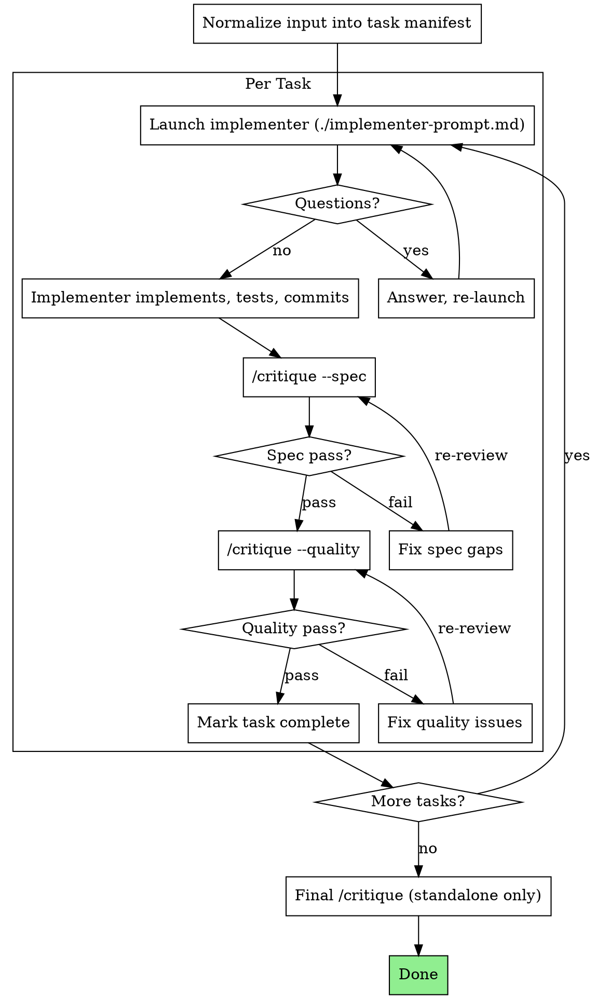

Arguments: $ARGUMENTS

# Planning

Sequential plan executor: read a plan, implement each task via a child context, verify with `/critique` review gates, repeat until complete.

Plan creation is handled by native plan mode or `/critique --plan` for review. This skill focuses on structured execution.

## Execution Modes

| Mode | When | Planning does | Harness does |
|---|---|---|---|
| **Standalone** | User or `/caffeine` calls directly | Drives task loop + runs `/critique` gates + owns ledger | N/A |
| **Embedded** | `/harness` delegates during run phase | Parses plan + dispatches implementer per task | Drives round loop, runs verification gates, owns state + final review |

**Standalone**: planning owns the full lifecycle — task sequencing, implementer dispatch, `/critique --spec`, `/critique --quality`, final `/critique` (full), and its own ledger.

**Embedded**: planning is a plan adapter + implementer dispatcher only. Harness drives one round per task:

```
harness round N (for task N):
  propose:  planning dispatches implementer
  verify:   harness runs verification gates (/critique --spec, /critique --quality)
  evaluate: harness decides keep/discard
  record:   harness writes state.jsonl
```

## Implementation Protocol

Each task carries an implementation protocol that planning passes to the implementer:

- `tdd_required` -- default for features, bug fixes, refactors, and behavior changes
- `tdd_preferred` -- use test-first flow when practical, but allow a justified fallback
- `direct` -- for config-only, docs-only, generated code, or similar work where full red-first sequencing is not the right fit

When unsure, prefer `tdd_required`. For `tdd_required` tasks, the implementer must provide RED/GREEN evidence.

When a task involves mocks, test doubles, or test-only seams, read `references/testing-anti-patterns.md` and fold the relevant guidance into the implementer prompt.

## Dispatch Model

### Standalone

- Implementer and review gates are all foreground child contexts, consumed sequentially.
- Spec and quality review go through `/critique --spec` and `/critique --quality`.
- Orchestration stays in controller. Child workers do not invoke `/fanout` or `/critique`.

### Embedded (in /harness)

- Planning only dispatches the implementer child context.
- Harness owns `/critique` gates. Planning does not invoke `/critique` directly.

## Size Gate

- Multiple independent tasks or cross-file tasks needing staged verification: use this skill.
- Single low-risk task (one-file fix, obvious local change): stay local.
- If coordination overhead exceeds implementation effort: too heavy for this skill.
- Once chosen, keep the full gate: implement -> spec review -> quality review. No shortcuts.

## The Process (Standalone)

In embedded mode, harness drives the round loop and runs verification gates; planning only provides the implementer dispatch.



## Input Normalization

Planning accepts tasks from multiple sources:

- Plan file path (reads and extracts tasks)
- Inline task list (from harness or caller)
- Existing task manifest (resume)

All inputs are normalized into a canonical task manifest:

```yaml
tasks:
  - id: 1
    subject: "<task title>"
    full_text: "<complete task description>"
    acceptance: "<what counts as done>"
    implementation_protocol: tdd_required
    dependencies: []
    status: pending
```

Planning uses this field when dispatching the implementer. If a task omits it, inherit the plan-level protocol or default to `tdd_required`.

## Handling Implementer Status

**DONE:** Standalone: enter `/critique --spec`. Embedded: return to harness for verification gates.

**DONE_WITH_CONCERNS:** Implementation complete with doubts. Read concerns: correctness/scope issues -> address before review; observational notes -> record and continue to review.

**NEEDS_CONTEXT:** Missing information. Provide context and re-launch.

**BLOCKED:** Cannot complete. Assess cause:
1. Insufficient context -> provide and re-launch
2. Reasoning capacity -> re-launch with stronger model
3. Task too large -> split
4. Plan itself is wrong -> escalate to user

Do not ignore escalation. Do not retry the same model without changes.

## Task Ledger

### Standalone Mode

Append-only JSONL ledger at `.agents/planning.jsonl`. Events:

- `task_started`: `{task_id, subject, timestamp}`
- `review_completed`: `{task_id, profile: "spec"|"quality", verdict: "pass"|"fail"|"needs_escalation", timestamp}`
- `task_completed`: `{task_id, timestamp}`
- `run_completed`: `{final_verdict: "pass"|"fail"|"needs_escalation", timestamp}`

On startup: if ledger exists with incomplete tasks, resume from ledger.

### Review Verdict Handling (Standalone)

- `pass` -> continue to next gate or task
- `fail` -> fix and re-run the same review gate
- `needs_escalation` -> record verdict, pause task, surface blocker to caller/user

### Embedded Mode (in /harness)

Do not write `.agents/planning.jsonl`. Instead:

- Task manifest stored as harness artifact: `.harness/tasks/<task_id>/artifacts/plan-manifest.yaml`
- Harness drives one round per task. Harness owns commit/rollback and verification.
- Planning only provides implementer dispatch per round. No task loop, no review calls, no ledger.

---

## Red Flags

Never:
- Implement on main/master without user consent
- Skip spec or quality review in standalone mode
- Continue with unresolved issues
- Launch multiple implementers in parallel (file conflicts)
- Let child context read the plan file (provide full text in prompt)
- Omit scene-setting context in implementer prompt
- Accept "close enough" on spec compliance
- Start quality review before spec passes
- Treat `needs_escalation` as `pass` or `fail`
- Embedded mode: run `/critique` or drive task loop (harness owns these)
- Embedded mode: write own ledger (harness owns state)

Implementer asks questions: answer fully, provide context as needed.
Reviewer finds issues: implementer fixes -> reviewer re-reviews -> loop until pass.
Child context fails: launch new child context to fix. Do not fix manually (context pollution).

## Prompt Templates

- `./implementer-prompt.md` -- implementer child context prompt

## References

- `references/testing-anti-patterns.md` -- load when writing/changing tests, adding mocks, or considering test-only production seams

## Integration

Required workflow skills:
- `/critique` -- review gates (spec, quality, plan, full profiles)

Related skills:
- `superpowers:brainstorming` -- design exploration before planning
