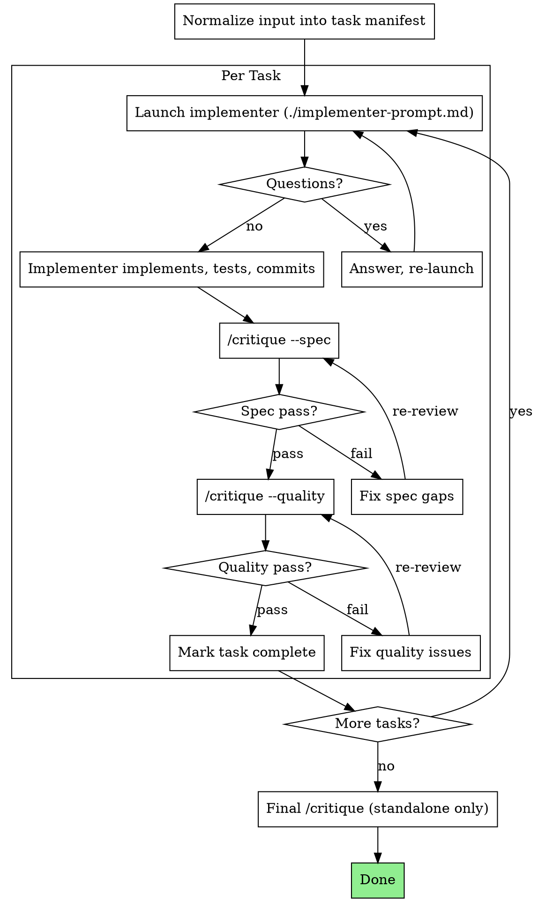

Arguments: $ARGUMENTS

# Planning

Structured plan lifecycle: generate implementation plans from goals/specs, then execute them task-by-task with staged review gates.

Two phases: **write** (generate a structured plan from goal/spec) and **run** (execute tasks sequentially via child contexts with `/critique` gates).

## Mode Detection

```
Explicit `/planning write` or `/planning run` → use that mode

Auto-infer:
  Goal/spec provided, no existing plan     → write
  Existing plan file or task manifest       → run
  Goal provided + full lifecycle requested  → write then run
```

---

## Phase: Write

Generate a structured implementation plan from a goal, spec, or requirements.

**Announce at start:** "Using the planning skill to create the implementation plan."

### Output Location

Do not hardcode plan file paths. Resolution order:

1. Caller specifies path explicitly (e.g., harness passes `.harness/tasks/<task_id>/plan.md`)
2. Agent infers from context (project conventions, active harness task, working directory)
3. Ask the user if ambiguous

### Scope Check

If the spec covers multiple independent subsystems, suggest breaking into separate plans — one per subsystem. Each plan should produce working, testable software on its own.

### File Structure

Before defining tasks, map out which files will be created or modified:

- Design units with clear boundaries and well-defined interfaces
- Prefer smaller, focused files over large ones that do too much
- Files that change together should live together; split by responsibility, not by technical layer
- In existing codebases, follow established patterns

### Task Granularity

Each step is one action (2-5 minutes). TDD cycle per task:

1. Write the failing test
2. Run it to verify it fails
3. Implement the minimal code to pass
4. Run tests to verify they pass
5. Commit

### Plan Document Structure

````markdown
# [Feature Name] Implementation Plan

> **For agentic workers:** Use `/planning run` (if subagents available) or follow steps directly. Steps use checkbox syntax for tracking.

**Goal:** [One sentence]
**Architecture:** [2-3 sentences]
**Tech Stack:** [Key technologies]

---

## Execution Summary

**Mutable Paths:** `src/foo/**`, `tests/foo/**`
**Immutable Paths:** `infra/**`
**Mandatory Verification:** `pytest tests/foo -q`
**Guard Checks:** `ruff check src tests`
**Acceptance Criteria:**
- valid input parses correctly
- invalid input returns structured error

---

### Task N: [Component Name]
**Task ID:** task-N
**Depends on:** task-M (or "none")

**Files:**
- Create: `exact/path/to/file.py`
- Modify: `exact/path/to/existing.py`
- Test: `tests/exact/path/to/test.py`

- [ ] **Step 1: Write the failing test**
  ```python
  def test_specific_behavior():
      result = function(input)
      assert result == expected
  ```

- [ ] **Step 2: Run test to verify it fails**
  Run: `pytest tests/path/test.py::test_name -v`
  Expected: FAIL

- [ ] **Step 3: Write minimal implementation**
  [complete code]

- [ ] **Step 4: Run test to verify it passes**
  Expected: PASS

- [ ] **Step 5: Commit**
````

Remember: exact file paths always, complete code (not "add validation"), exact commands with expected output.

### Plan Review Loop

After each chunk (delimited by `## Chunk N: <name>`, each ≤1000 lines):

1. Dispatch plan reviewer (see `./plan-reviewer-prompt.md`) in a foreground child context
2. Issues found: fix and re-dispatch
3. Approved: proceed to next chunk
4. Loop exceeds 5 iterations: surface to user

### Write Completion

Save the plan and report: "Plan complete and saved to `<path>`. Ready to execute?"

If caller is harness (embedded), return the plan path. If standalone, suggest execution workflow.

---

## Phase: Run

Sequential task executor: read a plan, implement each task via a child context, verify with `/critique` review gates, repeat until complete.

### Execution Modes

| Mode | When | Planning does | Harness does |
|---|---|---|---|
| **Standalone** | User or `/caffeine` calls directly | Drives task loop + runs `/critique` gates + owns ledger | N/A |
| **Embedded** | `/harness` delegates during run phase | Parses plan + dispatches implementer per task | Drives round loop, runs verification gates, owns state + final review |

**Standalone**: planning owns the full lifecycle — task sequencing, implementer dispatch, `/critique --spec`, `/critique --quality`, final `/critique` (full), and its own ledger.

**Embedded**: planning becomes a plan adapter + implementer dispatcher. Harness drives one round per task:

```
harness round N (for task N):
  propose:  planning dispatches implementer
  verify:   harness runs verification gates (/critique --spec, /critique --quality)
  evaluate: harness decides keep/discard
  record:   harness writes state.jsonl
```

Planning does not drive the task loop, run reviews, maintain its own ledger, or run final critique in embedded mode.

### Dispatch Model

#### Standalone

- Implementer and review gates are all foreground child contexts.
- Controller consumes results sequentially. Do not background these.
- Spec and quality review go through `/critique --spec` and `/critique --quality`.
- Orchestration stays in controller. Child workers do not invoke `/fanout` or `/critique`.

#### Embedded (in /harness)

- Planning only dispatches the implementer child context.
- Harness runs `/critique --spec` and `/critique --quality` as verification gates.
- Planning does not invoke `/critique` directly — harness owns the verification step.

### Size Gate

- Multiple independent tasks or cross-file tasks needing staged verification: use this skill.
- Single low-risk task (one-file fix, obvious local change): stay local.
- If coordination overhead exceeds implementation effort: too heavy for this skill.
- Once chosen, keep the full gate: implement -> spec review -> quality review. No shortcuts.

### The Process (Standalone)

In embedded mode, harness drives the round loop and runs verification gates; planning only provides the implementer dispatch.



### Input Normalization

Planning accepts tasks from multiple sources:

- Plan file path (reads and extracts tasks)
- Inline task list (from harness or caller)
- Existing task manifest (resume)

All inputs are normalized into a canonical task manifest:

```yaml
tasks:
  - id: 1
    subject: "<task title>"
    full_text: "<complete task description>"
    acceptance: "<what counts as done>"
    dependencies: []
    status: pending
```

### Handling Implementer Status

**DONE:** Standalone: enter `/critique --spec`. Embedded: return to harness for verification gates.

**DONE_WITH_CONCERNS:** Implementation complete with doubts. Read concerns: correctness/scope issues -> address before review; observational notes -> record and continue to review.

**NEEDS_CONTEXT:** Missing information. Provide context and re-launch.

**BLOCKED:** Cannot complete. Assess cause:
1. Insufficient context -> provide and re-launch
2. Reasoning capacity -> re-launch with stronger model
3. Task too large -> split
4. Plan itself is wrong -> escalate to user

Do not ignore escalation. Do not retry the same model without changes.

### Task Ledger

#### Standalone Mode

Append-only JSONL ledger at `.agents/planning.jsonl`. Events:

- `task_started`: `{task_id, subject, timestamp}`
- `review_completed`: `{task_id, profile: "spec"|"quality", verdict: "pass"|"fail"|"needs_escalation", timestamp}`
- `task_completed`: `{task_id, timestamp}`
- `run_completed`: `{final_verdict: "pass"|"fail"|"needs_escalation", timestamp}`

On startup: if ledger exists with incomplete tasks, resume from ledger.

#### Review Verdict Handling (Standalone)

- `pass` -> continue to next gate or task
- `fail` -> fix and re-run the same review gate
- `needs_escalation` -> record verdict, pause task, surface blocker to caller/user

#### Embedded Mode (in /harness)

Do not write `.agents/planning.jsonl`. Instead:

- Task manifest stored as harness artifact: `.harness/tasks/<task_id>/artifacts/plan-manifest.yaml`
- Harness drives one round per task. Harness owns commit/rollback and verification.
- Planning only provides implementer dispatch per round. No task loop, no review calls, no ledger.

---

## Red Flags

Never:
- Start implementation on main/master without user consent
- Skip any review stage (spec or quality) in standalone mode
- Continue with unresolved issues
- Launch multiple implementers in parallel (file conflicts)
- Let child context read the plan file (provide full text in prompt)
- Omit scene-setting context
- Accept "close enough" on spec compliance
- Start quality review before spec passes
- Treat `needs_escalation` as `pass` or `fail`
- In embedded mode: run `/critique` or drive task loop (harness owns verification and round cycling)
- In embedded mode: write own ledger (harness owns state)

Implementer asks questions: answer fully, provide context as needed.
Reviewer finds issues: implementer fixes -> reviewer re-reviews -> loop until pass.
Child context fails: launch new child context to fix. Do not fix manually (context pollution).

## Prompt Templates

- `./implementer-prompt.md` -- implementer child context prompt
- `./plan-reviewer-prompt.md` -- plan document reviewer prompt

## Integration

Required workflow skills:
- `/critique` -- review gates (spec, quality, full profiles)

Related skills:
- `superpowers:brainstorming` -- design exploration before plan writing
- `superpowers:test-driven-development` -- TDD within each task
