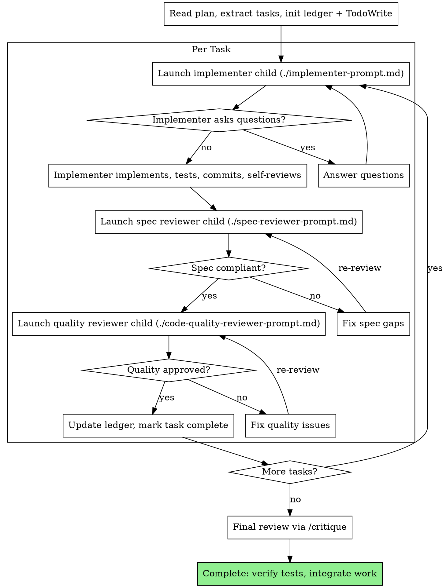

Arguments: $ARGUMENTS

# Subagent-Driven Development

Controller for executing a written implementation plan through foreground child contexts and staged review gates.

## Dispatch Model

- 这个技能拥有的是前台 critical-path child workflow：implementer、spec reviewer、code quality reviewer 都默认是 foreground child contexts。
- 不要把这些 per-task child contexts 放到 background 里跑，因为 controller 需要按顺序消费结果。
- 不要让 implementer 或 reviewer child 再去调用 `/orchestrate` 或 `/critique`。orchestration 继续留在 controller。
- 平台 dispatch 语法不写进 prompt template；prompt template 只定义 role、输入、输出和 stop rule。平台映射见 `../using-agents/references/orchestration-architecture.md`。

## When to Use

有书面实现计划，任务边界基本独立，希望在当前 session 内由 controller 按任务推进，并在每个任务后经过 staged review gate。

vs. sequential plan execution（另开 session 或无 subagent 时直接按步骤做）：
- 同 session，无上下文切换
- 每任务全新 child context，无上下文污染
- 两阶段 review 自动化
- 无需人工介入即可连续推进

## Size Gate

- 当计划包含多个独立任务，或单个任务跨多个文件/边界且需要独立验证时，优先使用本技能。
- 当计划只有一个很小的低风险任务，例如单文件小改、明显的局部修复、或无需 staged review 就能稳定验证的工作，优先留在本地执行路径。
- 如果 controller 的主要开销会落在协调而不是实现本身，这个技能就太重了。
- 一旦选择本技能，就保持完整 gate：implementer -> spec review -> code quality review。不要在技能内部再临时发明“半套”模式。

## The Process



## Handling Implementer Status

Implementer 返回四种状态：

**DONE:** 进入 spec compliance review。

**DONE_WITH_CONCERNS:** 实现完成但有疑虑。先读 concerns：正确性/范围问题先处理再 review；观察性备注（如"文件变大了"）记录后继续 review。

**NEEDS_CONTEXT:** 缺少信息。补充上下文后重新 launch。

**BLOCKED:** 无法完成。评估原因：
1. 上下文不足 → 补充后重新 launch
2. 推理能力不够 → 用更强模型重新 launch
3. 任务过大 → 拆分
4. 计划本身有误 → 上报用户

不要忽略 escalation，不要让同一模型在没有变化的情况下重试。

## Task Ledger

任务状态持久化到项目级 `.agents/tasks.json`，确保跨会话、跨 CLI 可恢复。

ledger 是权威源。先写 ledger，再从 ledger 同步 TodoWrite。
启动时：若 `.agents/tasks.json` 存在且有未完成任务，从 ledger 恢复进度并重建 TodoWrite 状态，而非重新提取。
每次状态变更（launch、review pass/fail、complete）时先更新 ledger，再同步 TodoWrite。

Schema：

- `plan_source`: 计划文件路径
- `tasks[].id`: 任务序号
- `tasks[].subject`: 任务标题
- `tasks[].status`: `pending | in_progress | review | completed | blocked`
- `tasks[].owner`: 当前负责的 child role
- `tasks[].review_log`: spec/quality review 结果摘要
- `tasks[].updated_at`: ISO 时间戳

`.agents/` 目录应加入 `.gitignore`（运行时状态不入 repo）。

## Prompt Templates

- `./implementer-prompt.md` — implementer child context prompt
- `./spec-reviewer-prompt.md` — spec compliance reviewer child context prompt
- `./code-quality-reviewer-prompt.md` — code quality reviewer child context prompt

## Example Workflow

```
[读取计划，提取全部 5 个任务，初始化 .agents/tasks.json + TodoWrite]

Task 1: Hook installation script
[Launch implementer child，提供完整任务文本 + 上下文]
Implementer: "hook 装在 user 还是 system level？"
→ 回答后重新 launch
Implementer: 实现完成，5/5 测试通过，已 commit
[Launch spec reviewer child] → ✅ 合规
[Launch quality reviewer child] → ✅ 通过
[标记 Task 1 完成]

Task 2: Recovery modes
[Launch implementer child]
[Launch spec reviewer child] → ❌ 缺少 progress reporting
[Implementer 修复] → [Re-review] → ✅
[Launch quality reviewer child] → ✅
[标记 Task 2 完成]

... 剩余任务同理 ...

 [全部完成后调用 /critique 做最终 review]
```

## 优势

- 每任务全新 child context，无上下文污染
- 两阶段 review（spec → quality）自动化质量门禁
- Spec compliance 防止过度/不足构建
- Controller 预提取任务文本，child worker 无需读文件
- 成本更高（每任务 3 次 child context），但问题发现更早

## Red Flags

Never:
- 未经用户同意在 main/master 上开始实现
- 跳过任何一阶段 review（spec compliance 或 code quality）
- 带着未修复的问题继续
- 并行 launch 多个 implementer（文件冲突）
- 让 child context 自己读计划文件（应提供完整文本）
- 省略场景上下文（child worker 需要理解任务在整体中的位置）
- 忽略 implementer 提问（回答后再让其继续）
- spec compliance 有问题时接受"差不多"
- 跳过 review loop（reviewer 发现问题 → implementer 修复 → 再次 review）
- 用 implementer self-review 替代正式 review（两者都需要）
- 在 spec compliance ✅ 之前开始 code quality review（顺序不可颠倒）
- 任一 review 有未关闭问题时进入下一任务

Implementer 提问时：完整回答，必要时补充上下文，不要催促实现。
Reviewer 发现问题时：implementer 修复 → reviewer 再次 review → 循环直到通过。
Child context 失败时：launch 新 child context 修复，不要手动修（上下文污染）。

## Integration

必需的工作流 skill：
- `worktree-dev` — 开始前建立隔离工作区
- `superpowers:writing-plans` — 创建本 skill 执行的计划

Per-task review 使用本 skill 内置的 `./code-quality-reviewer-prompt.md` 模板。
全量 review（最终 review 或独立 review）使用 `/critique`。

Related skill:
- `superpowers:test-driven-development` — 每个任务遵循 TDD
